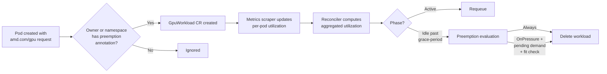

# GPU Preemption

GPU preemption automatically detects idle GPU workloads and terminates them to free resources for pending work. Unlike [Resource Monitoring](resource-monitoring.md), which is limited to Kaiwo CRDs (`KaiwoJob` / `KaiwoService`), GPU preemption works with **any** Kubernetes workload that requests AMD GPUs -- bare Pods, Jobs, Deployments, KaiwoJobs, RayJobs, or any other resource type.

The system relies on a CRD, `GpuWorkload`, which tracks each opted-in workload's GPU utilization and lifecycle. These CRs are created automatically when a qualifying Pod is scheduled, and they persist after the workload is deleted to provide an audit trail.

## How It Works



1. **Discovery** -- The controller watches all Pods. When a Pod requesting any `amd.com/*` GPU resource (e.g. `amd.com/gpu`, `amd.com/gpu-0`, partitioned resources) is created, the controller resolves its root owner (walking `ownerReferences` up through ReplicaSets, Jobs, etc.) and checks for preemption annotations on both the root owner and the pod's namespace. Namespace annotations serve as defaults; workload-level annotations override them.
2. **Tracking** -- A `GpuWorkload` CR is created for each unique root owner, capturing the GPU resource counts and annotation-derived settings.
3. **Metrics** -- A background scraper polls the AMD GPU operator's Prometheus endpoint (`gpu_gfx_activity`) and writes per-pod utilization into the `GpuWorkload` status.
4. **Reconciliation** -- The reconciler aggregates utilization, determines the phase (`PendingOther`, `PendingGpu`, `Active`, `Idle`, etc.), and evaluates preemption when conditions are met.
5. **Preemption** -- When an idle workload becomes eligible, a Lease-guarded evaluation ensures only one controller replica runs the global preemption decision at a time, preventing race conditions and over-preemption.

!!! note "AMD GPUs only"
    GPU preemption currently supports AMD GPU resources (`amd.com/*`). NVIDIA GPUs are not tracked by this feature.

### Supported Owner Types

The controller resolves pod ownership by walking the `ownerReferences` chain. The operator has RBAC permissions for the following owner types out of the box:

- `batch/v1` Jobs
- `apps/v1` Deployments, ReplicaSets, StatefulSets
- `ray.io/v1` RayClusters, RayJobs, RayServices
- `kaiwo.silogen.ai/v1alpha1` KaiwoJobs, KaiwoServices
- `aim.silogen.ai/v1alpha1` AIMServices
- `aim.eai.amd.com/v1alpha1` AIMServices
- `workload.codeflare.dev/v1beta2` AppWrappers

For workloads owned by other resource types (e.g. CronJobs, DaemonSets, custom controllers), add `get` and `delete` permissions for those resources to the operator `ServiceAccount`. `get` is needed to resolve the owner chain and read annotations; `delete` is needed for preemption. Without `get`, the controller will log an RBAC error and skip the pod.

## Configuration Hierarchy

Each setting is resolved through a 5-tier chain. The first non-empty value wins:

```
per-workload annotation  >  namespace annotation  >  KaiwoConfig  >  operator env var  >  hardcoded fallback
```

This lets you set cluster-wide runtime defaults (via `KaiwoConfig`), override them per namespace (via namespace annotations), and further override per workload (via workload annotations), while env vars and hardcoded values provide a safety net.

## Enabling GPU Preemption

### 1. Operator startup: Helm values / env vars

Enable the feature and point it at the AMD GPU metrics exporter:

```yaml
gpuPreemption:
  enabled: true
  # Replace with the actual in-cluster URL of your AMD GPU metrics exporter.
  metricsEndpoint: "http://amd-gpu-metrics-exporter.gpu-operator.svc:5000/metrics"
  pollingInterval: "15s"
  defaultThreshold: "5"
  defaultGracePeriod: "10m"
  defaultPolicy: "OnPressure"
  defaultAggregation: "Max"
  defaultTTL: "24h"
```

These map to operator environment variables (see [Environment Variables](#environment-variables) below). Changing them requires an operator restart.

!!! warning "Operator restart required"
    `enabled`, `metricsEndpoint`, and `pollingInterval` can **only** be set via Helm values / environment variables — they are not available in `KaiwoConfig` or per-workload annotations. These settings control the controller and metrics scraper startup, so any change requires an **operator restart** to take effect.

### 2. Cluster-wide runtime defaults: KaiwoConfig

The `KaiwoConfig` cluster-scoped singleton provides live-tunable defaults that take effect without restarting the operator. Add a `gpuPreemption` section to the spec:

```yaml
apiVersion: config.kaiwo.silogen.ai/v1alpha1
kind: KaiwoConfig
metadata:
  name: kaiwo
spec:
  gpuPreemption:
    defaultThreshold: 10
    defaultGracePeriod: "15m"
    defaultPolicy: "OnPressure"
    defaultAggregation: "Max"
    defaultTTL: "12h"
```

All fields are optional. Omitted fields fall through to the env var / hardcoded fallback.

!!!note
    `enabled`, `metricsEndpoint`, and `pollingInterval` are **not** available in `KaiwoConfig`. These are startup-only settings (Helm / env vars) that require an operator restart to change. All other settings (`defaultThreshold`, `defaultGracePeriod`, `defaultPolicy`, `defaultAggregation`, `defaultTTL`) can be tuned live via `KaiwoConfig` without restarting.

### 3. Per-namespace: Annotations

Annotate a **Namespace** to opt in all GPU workloads in that namespace. This is convenient when you want every GPU workload in a namespace to be tracked without annotating each one individually:

```yaml
apiVersion: v1
kind: Namespace
metadata:
  name: ml-team
  annotations:
    kaiwo.silogen.ai/gpu-preemption.enabled: "true"
    kaiwo.silogen.ai/gpu-preemption.grace-period: "15m"
    kaiwo.silogen.ai/gpu-preemption.policy: "OnPressure"
```

Any GPU workload created in this namespace will be automatically tracked. Individual workloads can still override specific settings with their own annotations (see below).

### 4. Per-workload: Annotations

Add annotations to the **root owner** resource (the Job, Deployment, KaiwoJob, etc. -- not the Pod template) to opt it in or override namespace defaults:

```yaml
apiVersion: batch/v1
kind: Job
metadata:
  name: my-training-job
  annotations:
    kaiwo.silogen.ai/gpu-preemption.grace-period: "5m"
    kaiwo.silogen.ai/gpu-preemption.policy: "Always"
spec:
  template:
    spec:
      containers:
      - name: train
        resources:
          requests:
            amd.com/gpu: "4"
          limits:
            amd.com/gpu: "4"
        # ...
```

!!!note
    Any annotation with the `kaiwo.silogen.ai/gpu-preemption.` prefix enables preemption tracking. This means:

    - `.enabled: "true"` on its own is valid -- all settings use cluster-wide defaults.
    - `.grace-period: "5m"` on its own is also valid -- it implicitly enables tracking without needing `.enabled`.
    - Any combination works; omitted settings fall back through namespace annotations, then KaiwoConfig, then env vars, then hardcoded defaults.
    - Annotations on the workload take precedence over identical annotations on the namespace.

## Annotations Reference

All annotations use the prefix `kaiwo.silogen.ai/gpu-preemption.` and can be placed on the root owner resource and/or the namespace. Each setting follows the resolution chain: **workload annotation > namespace annotation > KaiwoConfig > env var > hardcoded fallback**.

| Annotation | Description | KaiwoConfig field | Env var | Default |
|---|---|---|---|---|
| `.enabled` | Explicitly enable tracking. Can be used on its own (all other settings fall back to defaults). Not required if any other preemption annotation is set. | -- | -- | -- |
| `.grace-period` | Duration the workload must be continuously idle before it becomes preemptible (e.g. `5m`, `1h`). | `gpuPreemption.defaultGracePeriod` | `GPU_PREEMPTION_DEFAULT_GRACE_PERIOD` | `10m` |
| `.threshold` | Utilization percentage below which the workload is considered idle. | `gpuPreemption.defaultThreshold` | `GPU_PREEMPTION_DEFAULT_THRESHOLD` | `5` |
| `.policy` | Preemption policy: `OnPressure` or `Always`. | `gpuPreemption.defaultPolicy` | `GPU_PREEMPTION_DEFAULT_POLICY` | `OnPressure` |
| `.aggregation` | How utilization is aggregated across pods: `Min`, `Max`, or `Avg`. | `gpuPreemption.defaultAggregation` | `GPU_PREEMPTION_DEFAULT_AGGREGATION` | `Max` |
| `.ttl` | How long the `GpuWorkload` CR is retained after the workload reaches a terminal state. `0` means retain forever. | `gpuPreemption.defaultTTL` | `GPU_PREEMPTION_DEFAULT_TTL` | `24h` |

## Preemption Policies

### `OnPressure` (default)

A workload is only preempted when **all** of the following are true:

- It has been idle longer than `grace-period`.
- Another `GpuWorkload` is in the `PendingGpu` phase -- meaning its pods are unschedulable **specifically because of insufficient GPU resources** (the scheduler's `PodScheduled` condition message must contain `Insufficient amd.com/gpu`). Pods pending for other reasons show as `PendingOther` and do not trigger preemption.
- A **fit check** passes (see below).

**Fit check and multi-victim accumulation:** The evaluator does not consider idle workloads in isolation. For each pending workload, it walks the idle pool (sorted oldest-idle first) and accumulates GPU counts across multiple idle workloads until the combined total meets the pending demand. If the combined total of all eligible idle workloads is still less than what the pending workload needs, **none of them are preempted** -- the system avoids pointless evictions. If the total does meet the demand, all workloads in the accumulated set are marked for preemption together. This is matched by GPU resource name (e.g. `amd.com/gpu`), so workloads using different GPU partition profiles do not interfere with each other.

Already-claimed victims are excluded from subsequent pending workloads' evaluations, preventing double-preemption.

### `Always`

The workload is preempted as soon as it has been idle longer than `grace-period`, regardless of whether any other workload is waiting. This is useful for strict resource reclamation policies.

## Environment Variables

These are set on the Kaiwo operator deployment, typically via Helm values under `gpuPreemption.*`:

| Variable | Description | Helm value | Hardcoded fallback |
|---|---|---|---|
| `GPU_PREEMPTION_ENABLED` | Enable the GPU preemption controller and metrics scraper (`true`/`false`). | `gpuPreemption.enabled` | `false` |
| `GPU_PREEMPTION_METRICS_ENDPOINT` | URL of the AMD GPU metrics exporter Prometheus endpoint. | `gpuPreemption.metricsEndpoint` | _(required)_ |
| `GPU_PREEMPTION_POLLING_INTERVAL` | How often the scraper polls the metrics endpoint (e.g. `15s`, `1m`). | `gpuPreemption.pollingInterval` | `15s` |
| `GPU_PREEMPTION_DEFAULT_THRESHOLD` | Default utilization threshold (%) below which a workload is idle. | `gpuPreemption.defaultThreshold` | `5` |
| `GPU_PREEMPTION_DEFAULT_GRACE_PERIOD` | Default idle duration before preemption eligibility (e.g. `10m`, `1h`). | `gpuPreemption.defaultGracePeriod` | `10m` |
| `GPU_PREEMPTION_DEFAULT_POLICY` | Default preemption policy (`OnPressure` or `Always`). | `gpuPreemption.defaultPolicy` | `OnPressure` |
| `GPU_PREEMPTION_DEFAULT_AGGREGATION` | Default multi-pod aggregation policy (`Min`, `Max`, or `Avg`). | `gpuPreemption.defaultAggregation` | `Max` |
| `GPU_PREEMPTION_DEFAULT_TTL` | Default TTL for terminal `GpuWorkload` CRs (`0` = retain forever). | `gpuPreemption.defaultTTL` | `24h` |
| `GPU_PREEMPTION_OPERATOR_NAMESPACE` | Namespace where the operator runs (used for Lease coordination). | -- | _(auto-detected)_ |

## GpuWorkload Lifecycle

Each `GpuWorkload` CR transitions through the following phases:

| Phase | Meaning |
|---|---|
| `PendingOther` | Pods exist but are not yet Running for non-GPU reasons: image pulls, init containers, PVC binding, node affinity, taints, etc. No idle time is counted and no preemption evaluation is triggered. |
| `PendingGpu` | Pods are unschedulable **specifically because of insufficient GPU resources** (validated by checking the scheduler's `PodScheduled` condition for `Insufficient amd.com/gpu`). Acts as the demand signal for `OnPressure` preemption. |
| `Active` | Pods are running and aggregated GPU utilization is at or above the threshold. |
| `Idle` | Pods are running but aggregated GPU utilization is below the threshold. The `grace-period` timer starts. |
| `Preempting` | The workload has been selected for preemption; deletion of the root owner is in progress. |
| `Preempted` | The root owner was successfully deleted by the preemption system. |
| `Deleted` | The root owner disappeared on its own (completed, manually deleted, etc.). |

After reaching `Preempted` or `Deleted`, the CR is retained for `ttlAfterFinished` (default 24h) to provide an audit trail, then automatically cleaned up.

### GpuWorkload naming

`GpuWorkload` CRs are named deterministically from the root owner: `<lowercase-kind>-<name>-<uid-prefix>`. For example, a Job named `training` with UID `a1b2c3d4-...` produces a `GpuWorkload` named `job-training-a1b2c3d4`.

## Inspecting GpuWorkloads

```bash
# List all tracked GPU workloads
kubectl get gpuworkloads -A

# Detailed view with utilization and phase
kubectl get gpuworkloads -A -o wide

# Inspect a specific workload
kubectl describe gpuworkload job-training-a1b2c3d4 -n my-namespace
```

The status includes:

- `aggregatedUtilization` -- current utilization percentage
- `idleSince` -- when the workload became idle
- `ownerChain` -- the full owner reference path (e.g. `Pod/worker-0 -> Job/training -> KaiwoJob/my-job`)
- `preemptedFor` -- the pending workload this was preempted to make room for
- `preemptionReason` -- human-readable explanation

### Example GpuWorkload CR

The following shows a representative `GpuWorkload` for an idle training Job, with all fields populated as they would appear during normal operation:

```yaml
apiVersion: kaiwo.silogen.ai/v1alpha1
kind: GpuWorkload
metadata:
  name: job-batch-training-a1b2c3d4      # <lowercase-kind>-<name>-<uid-prefix>
  namespace: ml-team
spec:
  workloadRef:
    apiVersion: batch/v1
    kind: Job
    name: batch-training
    uid: a1b2c3d4-e5f6-7890-abcd-ef1234567890
  gpuResources:
    amd.com/gpu: 4                        # total GPUs requested across all pods
  utilizationThreshold: 5.0              # % below which the workload is idle (optional override)
  gracePeriod: 10m                       # idle duration before preemption eligibility (optional override)
  preemptionPolicy: OnPressure           # OnPressure or Always (optional override)
  aggregationPolicy: Max                 # Min, Max, or Avg across pods (optional override)
  ttlAfterFinished: 24h                  # how long to retain after terminal phase (optional override)
status:
  phase: Idle
  aggregatedUtilization: 1.2            # current %, below threshold → Idle
  idleSince: "2026-03-04T10:00:00Z"
  ownerChain: "Pod/batch-training-xw7n5 -> Job/batch-training"
  lastMetricsUpdate: "2026-03-04T10:14:45Z"
  podUtilizations:
  - podName: batch-training-xw7n5
    gpuId: "0"
    utilization: 2.1
    lastUpdate: "2026-03-04T10:14:45Z"
  - podName: batch-training-xw7n5
    gpuId: "1"
    utilization: 0.3
    lastUpdate: "2026-03-04T10:14:45Z"
  conditions:
  - type: PhaseUpdated
    status: "True"
    reason: PhaseIdle
    message: "GPU utilization dropped to 1.2%, workload is now considered idle"
    lastTransitionTime: "2026-03-04T10:00:00Z"
```

For a preempted workload the status also includes:

```yaml
status:
  phase: Preempted
  preemptedAt: "2026-03-04T10:15:00Z"
  preemptedFor: "job-high-priority-demand-b2c3d4e5"
  preemptionReason: "Preempted to free 4 amd.com/gpu for pending workload job-high-priority-demand-b2c3d4e5"
  finishedAt: "2026-03-04T10:15:00Z"   # TTL countdown starts here
```

## Examples

### Reclaim idle GPUs under pressure (default behavior)

```yaml
apiVersion: batch/v1
kind: Job
metadata:
  name: batch-inference
  annotations:
    kaiwo.silogen.ai/gpu-preemption.grace-period: "10m"
spec:
  # ...
```

This uses the default `OnPressure` policy. The Job will only be preempted if it has been idle for 10 minutes **and** another GPU workload is pending due to insufficient GPUs **and** the combined GPUs freed by this (and potentially other idle) workloads would satisfy the pending demand.

### Strict reclamation with short idle window

```yaml
apiVersion: apps/v1
kind: Deployment
metadata:
  name: dev-notebook
  annotations:
    kaiwo.silogen.ai/gpu-preemption.policy: "Always"
    kaiwo.silogen.ai/gpu-preemption.grace-period: "5m"
    kaiwo.silogen.ai/gpu-preemption.threshold: "10"
spec:
  # ...
```

The Deployment is terminated if GPU utilization stays below 10% for 5 minutes, regardless of cluster demand.

### Opt-in with defaults only

```yaml
metadata:
  annotations:
    kaiwo.silogen.ai/gpu-preemption.enabled: "true"
```

Uses all cluster-wide defaults from KaiwoConfig, then Helm values / environment variables.

### Namespace-wide opt-in

```yaml
apiVersion: v1
kind: Namespace
metadata:
  name: ml-team
  annotations:
    kaiwo.silogen.ai/gpu-preemption.enabled: "true"
    kaiwo.silogen.ai/gpu-preemption.grace-period: "15m"
```

All GPU workloads in `ml-team` are automatically tracked with a 15-minute grace period. Individual workloads can still override settings with their own annotations -- for example, setting `.policy: "Always"` on one Job overrides the default `OnPressure` inherited from the namespace.

## Comparison with Resource Monitoring

| Aspect | Resource Monitoring | GPU Preemption |
|---|---|---|
| Scope | `KaiwoJob` and `KaiwoService` only | Any Kubernetes GPU workload |
| Opt-in | Automatic for Kaiwo CRDs | Annotation on the root owner or namespace |
| CRD | None (status on Kaiwo CRDs) | `GpuWorkload` per tracked workload |
| Demand awareness | No | Yes (`OnPressure` with fit checks) |
| Audit trail | Status conditions on Kaiwo CRDs | Persistent `GpuWorkload` CRs with TTL |
| GPU vendor | NVIDIA or AMD | AMD (via `amd.com/gpu*` resources) |

## Troubleshooting

- **GpuWorkload not created?**
    - Verify the root owner (not the Pod template) or its namespace has at least one `kaiwo.silogen.ai/gpu-preemption.*` annotation.
    - Check that the Pod requests `amd.com/gpu*` resources.
    - Check operator logs for RBAC errors during owner resolution -- the operator needs `get` permissions on all resource types in the owner chain.

- **Workload stuck in Idle but not preempted?**
    - With `OnPressure` policy: preemption only happens when another `GpuWorkload` is in the `PendingGpu` phase (pods unschedulable due to `Insufficient amd.com/gpu`, not other reasons) and its demand fits. Check `kubectl get gpuworkloads` for a `PendingGpu` phase entry.
    - With `Always` policy: ensure `grace-period` has elapsed. Check `idleSince` on the GpuWorkload status.

- **Metrics not updating?**
    - Verify `GPU_PREEMPTION_METRICS_ENDPOINT` is reachable from the operator pod.
    - Check that the AMD GPU operator's metrics exporter is running and exposing `gpu_gfx_activity`.

- **Over-preemption concerns?**
    - The system uses a Kubernetes Lease for mutual exclusion during preemption evaluation. Only one replica evaluates at a time. The fit check accumulates idle workloads until demand is met and skips entirely if even all idle workloads together cannot satisfy the demand. Already-claimed victims are excluded from subsequent evaluations to prevent double-preemption.
